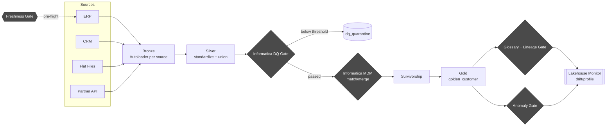

# Databricks + Informatica MDM/DQ Governed Medallion Pipeline

A Databricks medallion architecture (Bronze → Silver → Gold) where Informatica
Data Quality and Informatica MDM match/merge are **enforced gates** between
Silver and Gold — not a bolt-on — with Unity Catalog glossary/lineage and
freshness/drift/anomaly checks wired in as controls that can halt bad data
before it reaches Gold.

## Business Problem

Core business entities (customers, accounts, products) are defined
independently across ERP, CRM, flat files, and APIs. Raw data lands in
Databricks Bronze/Silver as Delta Lake staging, but without a governed,
quality-assured, de-duplicated "single source of truth," downstream
consumers — analytics, reporting, risk/compliance — inherit inconsistent,
unmatched, and unmonitored records. Specifically:

- **No golden record discipline** — Silver may contain duplicate/conflicting
  entity representations (e.g. the same customer from ERP and CRM) with no
  match/merge logic before reaching curated Gold.
- **Data quality isn't enforced pre-merge** — validation, standardization,
  and match-readiness rules aren't systematically applied before records are
  consolidated, so a golden record can be built on flawed inputs.
- **Lineage and glossary context are disconnected from the pipeline** —
  governance metadata exists alongside the pipeline rather than being
  enforced as a gate within it.
- **Pipeline health is reactive** — freshness, drift, and anomaly detection
  sit as a bolt-on observability layer rather than an integrated control
  that can halt bad data from propagating to Gold.

## Why This Problem Matters

Without integrating MDM, DQ, governance, and observability directly into the
medallion flow: inaccurate golden records feed regulatory/compliance
reporting, pipeline or data drift is detected late (if at all), lineage and
glossary traceability has audit gaps, and trust erodes in the Gold layer as
the "curated, enriched, DQ-scored" source of truth. For a regulated,
multi-source entity (customer/account data feeding compliance reporting),
that trust gap is not cosmetic — it's the difference between a defensible
audit trail and a reporting number nobody can trace back to its inputs.

## Solution

A Databricks Lakeflow Declarative Pipeline (DLT) where every stage between
raw ingestion and Gold is a **named, testable gate**, each backed by an
abstract client interface so Informatica can be swapped in for a local
fallback without changing pipeline code:

1. **Bronze** — Autoloader ingests each source system independently, tagged
   with provenance (`_source_system`, `_source_priority`, `_ingested_at`).
2. **Silver** — per-source column mapping onto one canonical entity schema,
   then unioned.
3. **DQ gate** — Informatica Data Quality (or a local rule-engine fallback)
   scores every record; anything below the configured threshold is
   quarantined, never reaches match/merge or Gold.
4. **MDM gate** — Informatica MDM SaaS batch match/merge (or a local
   GraphFrames blocking + Jaro-Winkler + connected-components fallback)
   clusters DQ-passed records into match groups; survivorship rules pick the
   surviving field values per cluster.
5. **Gold** — the golden record table, gated by `dlt.expect_or_fail` on
   `golden_id IS NOT NULL` and a minimum `dq_score` — a bad batch fails the
   whole pipeline update rather than publishing partial Gold data.
6. **Governance gate** — after the pipeline runs, a job task fails the run if
   any required Gold column lacks a registered business-glossary mapping, or
   if Unity Catalog hasn't captured lineage from Silver through to Gold in
   the last 24h.
7. **Observability gates** — a freshness check runs *before* the pipeline
   (halts on stale sources), and volume-anomaly / DQ-quarantine-rate checks
   run *after* it (halt before downstream notification); a Databricks
   Lakehouse Monitor is registered on the Gold table for ongoing drift
   detection.

Every rule set (DQ rules, match weights/thresholds, survivorship priority,
required glossary terms, freshness SLAs) is config-driven (`config/*.yml`),
not hardcoded, so tuning doesn't require touching pipeline code.

## Key Features

- Abstract `InformaticaDQClient` / `InformaticaMDMClient` interfaces — real
  IDMC/MDM SaaS REST implementations plus local fallbacks, toggled by a
  single `enabled: true/false` flag per config file.
- Hard pipeline gates (`dlt.expect_or_fail`, quarantine tables, raising job
  tasks) — governance and observability are enforced, not advisory.
- Config-driven DQ rules, match/merge weights and thresholds, survivorship
  priority, and glossary requirements.
- Unity Catalog governance: business glossary registry table, column tags
  (PII/sensitivity + glossary term), lineage verified via
  `system.access.table_lineage`.
- Databricks Asset Bundle (`databricks.yml`, `resources/*.yml`) orchestrating
  the DLT pipeline and gate tasks as a single dependency-ordered job.
- Terraform-provisioned Unity Catalog infrastructure (catalog, 7 schemas, 5
  managed Volumes, Informatica secret scope) — see [Implementation
  Detail](#implementation-detail).
- Unit tests for the DQ scoring fallback and survivorship logic
  (`tests/`).

## Benefits

- **Trustworthy Gold layer** — every golden record carries its own DQ score,
  match confidence, and source lineage, so consumers can see *why* a record
  looks the way it does, not just that it exists.
- **Fail-fast, not fail-silent** — a broken upstream feed, a stale source, or
  ungoverned Gold columns halt the pipeline instead of quietly degrading
  what analytics/compliance consume.
- **Swap-in real Informatica with zero pipeline rewrites** — the
  abstraction boundary means moving from the local fallback to production
  IDMC/MDM is a config + secret change, not a rearchitecture.
- **Auditable by construction** — glossary coverage and lineage are checked
  every run, not reviewed quarterly by a separate governance team.
- **Config, not code, for rule changes** — DQ thresholds, match weights, and
  survivorship priority are YAML, reviewable and versionable independent of
  pipeline logic.

## Measurable KPIs

These are the metrics the pipeline is instrumented to produce (via its own
tables and gates), framed as targets — this is a freshly provisioned
reference implementation, not a system with a production track record yet.

| KPI | Source | Target |
|---|---|---|
| DQ pass rate | `silver_customer_dq_passed` ÷ `silver_customer_dq_scored` | ≥ 85% (matches `min_dq_score_for_gold` config) |
| DQ quarantine rate | `silver_customer_dq_quarantine` ÷ `silver_customer_dq_scored`, daily | < 15% (anomaly gate halts above this) |
| De-duplication rate | 1 − (`gold_customer_golden` rows ÷ `silver_customer_dq_passed` rows) | Baseline once real data volume is known |
| Average match confidence | `avg(match_confidence)` on `gold_customer_golden` | ≥ 0.82 (matches `match_threshold` config) |
| Glossary coverage | required columns with a `governance.business_glossary` mapping | 100% (hard gate — job fails otherwise) |
| Lineage confirmation | `glossary_lineage_gate` task pass rate | 100% of scheduled runs |
| Freshness SLA compliance | per-source, against `config/sources.yml` SLAs (2–24h by source) | 100% of scheduled runs |
| Gold volume anomaly rate | `anomaly_gate` z-score breaches (\|z\| > 3) | 0 unexplained breaches/month |
| Time-to-Gold latency | Bronze ingestion timestamp → `merged_at` on Gold | Track once running on a real schedule |

## SWOT Overview

| | |
|---|---|
| **Strengths** | Enforced (not advisory) gates; config-driven rule tuning; Informatica abstracted behind an interface so the pipeline runs today without live credentials; infra as code (Terraform); governance built into the DAG, not bolted on. |
| **Weaknesses** | Local DQ/MDM fallbacks are simplistic compared to real Informatica IDQ/MDM accuracy; GraphFrames fallback needs a Maven cluster library; Informatica secrets are still placeholders; Terraform state is local-only (no remote backend yet); single entity (customer) scoped so far. |
| **Opportunities** | Extend to additional entities (account, product) reusing the same gate pattern; swap in live Informatica IDMC/MDM once credentials exist; add CI for bundle validate/deploy; add a remote Terraform backend for team use; build a steward review UI for quarantined/low-confidence records. |
| **Threats** | Informatica API/schema changes breaking the REST client contract; DQ/match thresholds drifting out of tune as real data profiles diverge from assumptions; monitoring/compute cost at production volume; governance gates becoming a rubber stamp if glossary/lineage checks aren't kept current as schemas evolve. |

## Roadmap

- **Phase 0 — Done.** Reference implementation scaffolded (Bronze→Silver→DQ
  gate→MDM gate→Gold), Unity Catalog infrastructure provisioned in the
  `lakehouse-demo` workspace (`mdm_dq_demo` catalog, 7 schemas, 5 managed
  Volumes, `informatica` secret scope), local Informatica fallbacks
  validated by unit tests.
- **Phase 1 — Informatica cutover.** Wire real IDMC/MDM credentials into the
  `informatica` secret scope, flip `informatica_dq.enabled` /
  `informatica_mdm.enabled` to `true`, validate DQ scores and match quality
  against a pilot dataset, tune thresholds.
- **Phase 2 — Hardening.** CI for `databricks bundle validate/deploy`, a
  remote Terraform state backend, extend beyond the `customer` entity
  (account, product) reusing the same gate pattern.
- **Phase 3 — Production rollout.** Steward review workflow for quarantined
  and low-confidence-match records, SLA dashboards on top of the Lakehouse
  Monitor output, cost monitoring for the observability gates themselves.
- **Phase 4 — Scale-out.** Multi-entity, multi-region governance;
  self-service glossary contribution workflow for business stewards.

## Implementation Detail

### Source Data

Four source systems land in Bronze, each with its own schema mapped onto one
canonical `customer` entity in Silver (see `src/silver/silver_transform.py`
for the per-source column maps):

| Source | Format | Landing Volume | Freshness SLA |
|---|---|---|---|
| ERP | Parquet | `/Volumes/mdm_dq_demo/landing/erp` | 24h |
| CRM | JSON | `/Volumes/mdm_dq_demo/landing/crm` | 6h |
| Flat files | CSV | `/Volumes/mdm_dq_demo/landing/flatfiles` | 24h |
| Partner API | JSON | `/Volumes/mdm_dq_demo/landing/api` | 2h |

### Architecture Diagram

### Ingestion Method

Databricks Autoloader (`cloudFiles`), one DLT streaming table per source
(`src/bronze/bronze_ingest.py`), schema inference on, provenance columns
(`_source_system`, `_source_priority`, `_ingested_at`, `_source_file`)
attached at ingestion so every downstream record can be traced to its
origin file.

### Transformation Logic

- **Standardization** (`src/silver/silver_transform.py`): per-source column
  renaming onto the canonical schema, trim/case normalization, email domain
  extraction — deliberately "dumb," no validation here.
- **DQ scoring** (`src/quality/dq_rules.py`, `dq_gate.py`): Informatica IDQ
  REST call (stage batch → trigger mapping → poll → read scored output) or a
  local rule-engine fallback producing the same `dq_score`/`dq_issues`
  contract.
- **Match/merge** (`src/mdm/match_merge.py`): Informatica MDM SaaS batch
  match REST call, or local blocking (country + postal prefix) + pairwise
  Jaro-Winkler/exact-match scoring + GraphFrames connected-components
  clustering.
- **Survivorship** (`src/mdm/survivorship.py`): source-priority-then-recency
  precedence per match cluster, rolling up member count and average match
  confidence onto the winning record.

### Storage Layer

Delta Lake on Unity Catalog managed storage (no customer-managed external
bucket needed — see [Terraform](#terraform-infrastructure) below). Catalog
`mdm_dq_demo`, schemas `bronze`/`silver`/`gold`/`governance`/`config` for
tables, `landing`/`staging` for Volumes. Gold table has
`delta.enableChangeDataFeed = true` for downstream consumers that want
incremental reads.

### Optimization and Reliability

- **Reliability via gates, not retries** — the whole point of this design is
  that a bad batch fails loudly (`expect_or_fail`, raised job-task
  exceptions) rather than degrading Gold silently.
- **Quarantine, not drop** — DQ failures are retained in
  `silver_customer_dq_quarantine` for stewardship review, never just
  discarded.
- **Idempotent infra** — Terraform-managed catalog/schemas/volumes/secrets;
  `pipelines.reset.allowed: "false"` on the DLT pipeline to avoid accidental
  full reprocessing.
- **Photon** enabled on the pipeline cluster for the join-heavy
  standardization/match-merge stages.
- **Lakehouse Monitoring** on the Gold table for ongoing profile/drift
  metrics rather than a one-off check.

#### Terraform Infrastructure

`terraform/` provisions the Unity Catalog objects this pipeline depends on:
catalog `mdm_dq_demo`, 7 schemas, 5 managed Volumes (`landing/{erp,crm,
flatfiles,api}`, `staging/informatica`), and the `informatica` secret scope
with placeholder secrets (`idmc_base_url`, `mdm_base_url`, `session_token`).
Managed Volumes were used deliberately — this metastore's other catalogs are
all Databricks-managed storage, so no external storage credential or cloud
IAM identity is required. State is currently local-only; move it to a remote
backend before this is used by more than one person.

## Business Result / Impact

This is a freshly provisioned reference implementation — the Unity Catalog
infrastructure is live (`mdm_dq_demo` catalog, schemas, and Volumes exist in
the `lakehouse-demo` workspace) but the pipeline hasn't run against real
production volume yet, and Informatica credentials are still placeholders.
The impact below is therefore **the design intent this architecture targets**,
not a measured outcome:

- Replace ad hoc, post-hoc deduplication with a systematic, config-driven
  match/merge gate — reducing the audit burden of explaining "why does this
  customer appear three times."
- Convert governance and observability from a periodic manual review into a
  per-run automated gate, shrinking the window between a data quality
  regression occurring and it being caught.
- Give downstream consumers (analytics, risk/compliance reporting) a Gold
  table that carries its own quality and lineage evidence, rather than
  requiring a separate governance sign-off process.

Once Phase 1 (Informatica cutover) runs against real data, the KPI table
above becomes the basis for reporting actual — not targeted — DQ pass rate,
match quality, and gate reliability.
