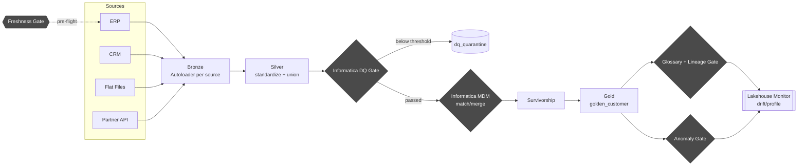

# Databricks + Informatica MDM/DQ Governed Medallion Pipeline

A Databricks medallion architecture (Bronze → Silver → Gold) where Informatica
Data Quality and Informatica MDM match/merge are **enforced gates** between
Silver and Gold — not a bolt-on — with Unity Catalog glossary/lineage and
freshness/drift/anomaly checks wired in as controls that can halt bad data
before it reaches Gold.

## Business Problem

Core business entities (customers, accounts, products) are defined
independently across ERP, CRM, flat files, and APIs. Raw data lands in
Databricks Bronze/Silver as Delta Lake staging, but without a governed,
quality-assured, de-duplicated "single source of truth," downstream
consumers — analytics, reporting, risk/compliance — inherit inconsistent,
unmatched, and unmonitored records. Specifically:

- **No golden record discipline** — Silver may contain duplicate/conflicting
  entity representations (e.g. the same customer from ERP and CRM) with no
  match/merge logic before reaching curated Gold.
- **Data quality isn't enforced pre-merge** — validation, standardization,
  and match-readiness rules aren't systematically applied before records are
  consolidated, so a golden record can be built on flawed inputs.
- **Lineage and glossary context are disconnected from the pipeline** —
  governance metadata exists alongside the pipeline rather than being
  enforced as a gate within it.
- **Pipeline health is reactive** — freshness, drift, and anomaly detection
  sit as a bolt-on observability layer rather than an integrated control
  that can halt bad data from propagating to Gold.

## Why This Problem Matters

Without integrating MDM, DQ, governance, and observability directly into the
medallion flow: inaccurate golden records feed regulatory/compliance
reporting, pipeline or data drift is detected late (if at all), lineage and
glossary traceability has audit gaps, and trust erodes in the Gold layer as
the "curated, enriched, DQ-scored" source of truth. For a regulated,
multi-source entity (customer/account data feeding compliance reporting),
that trust gap is not cosmetic — it's the difference between a defensible
audit trail and a reporting number nobody can trace back to its inputs.

## Solution

A Databricks Lakeflow Declarative Pipeline (DLT) where every stage between
raw ingestion and Gold is a **named, testable gate**, each backed by an
abstract client interface so Informatica can be swapped in for a local
fallback without changing pipeline code:

1. **Bronze** — Autoloader ingests each source system independently, tagged
   with provenance (`_source_system`, `_source_priority`, `_ingested_at`).
2. **Silver** — per-source column mapping onto one canonical entity schema,
   then unioned.
3. **DQ gate** — Informatica Data Quality (or a local rule-engine fallback)
   scores every record; anything below the configured threshold is
   quarantined, never reaches match/merge or Gold.
4. **MDM gate** — Informatica MDM SaaS batch match/merge (or a local
   blocking + Jaro-Winkler + union-find connected-components fallback)
   clusters DQ-passed records into match groups; survivorship rules pick the
   surviving field values per cluster.
5. **Gold** — the golden record table, gated by `dlt.expect_or_fail` on
   `golden_id IS NOT NULL` and a minimum `dq_score` — a bad batch fails the
   whole pipeline update rather than publishing partial Gold data.
6. **Governance gate** — after the pipeline runs, a job task fails the run if
   any required Gold column lacks a registered business-glossary mapping, or
   if Unity Catalog hasn't captured lineage from Silver through to Gold in
   the last 24h.
7. **Observability gates** — a freshness check runs *before* the pipeline
   (halts on stale sources), and volume-anomaly / DQ-quarantine-rate checks
   run *after* it (halt before downstream notification); a Databricks
   Lakehouse Monitor is registered on the Gold table for ongoing drift
   detection.

Every rule set (DQ rules, match weights/thresholds, survivorship priority,
required glossary terms, freshness SLAs) is config-driven (`config/*.yml`),
not hardcoded, so tuning doesn't require touching pipeline code — Phase 1
below proves this out: DQ scoring and match/merge were refactored to
actually read those rules instead of hardcoding them, then tuned against a
generated pilot dataset (see `pilot/PILOT_REPORT.md`).

The same gate pattern now also runs for a second entity, **account**
(`config/account_*.yml`, `src/*/*_account.py` files), reusing the DQ/MDM
classes and survivorship logic unchanged — proof the pattern generalizes,
not just a customer-specific pipeline with governance bolted on.

## Key Features

- Abstract `InformaticaDQClient` / `InformaticaMDMClient` interfaces — real
  IDMC/MDM SaaS REST implementations plus local fallbacks, toggled by a
  single `enabled: true/false` flag per config file.
- Hard pipeline gates (`dlt.expect_or_fail`, quarantine tables, raising job
  tasks) — governance and observability are enforced, not advisory.
- Config-driven DQ rules (severity-weighted), match/merge weights and
  thresholds, survivorship priority, and glossary requirements — tuned
  against a real pilot dataset, not just asserted (`pilot/PILOT_REPORT.md`).
- **Two entities, one pattern** — customer and account both run the same
  Bronze→Silver→DQ→MDM→Gold gate chain, sharing the generic DQ/match/
  survivorship logic; adding a third entity is a config addition plus ~4
  small per-entity files, not a pipeline rewrite.
- **Steward review workflow** — DQ quarantine and low-confidence matches
  feed one queue (`governance.steward_review_queue`); an approved
  quarantine decision actually re-routes that record into `*_dq_passed` on
  the next run (`src/governance/steward_review.py`), not just a note nobody
  acts on.
- **Self-service glossary submissions** — a steward can propose a glossary
  term without an engineer editing YAML and redeploying; approved
  submissions MERGE into `governance.business_glossary` and count toward
  the glossary gate immediately (`src/governance/glossary_submissions.py`).
- **Cost monitoring** — the pipeline's own compute spend
  (`system.billing.usage`, filtered by the `project=mdm-dq-medallion` cluster
  tag) is tracked with a soft budget warning and a hard circuit-breaker
  limit (`src/observability/cost_monitor.py`).
- Unity Catalog governance: business glossary registry table, column tags
  (PII/sensitivity + glossary term), lineage verified via
  `system.access.table_lineage` — all looped per-entity, not hardcoded to
  customer.
- Databricks Asset Bundle (`databricks.yml`, `resources/*.yml`) orchestrating
  the DLT pipeline and 8 gate/observability tasks as a single
  dependency-ordered job — **validated against the real target workspace**
  (`databricks bundle validate`, both `dev` and `prod` targets pass).
- Terraform-provisioned Unity Catalog infrastructure (catalog, 7 schemas, 5
  managed Volumes, Informatica secret scope) — **applied and live**, not
  just planned — see [Implementation Detail](#implementation-detail).
- CI (`.github/workflows/ci.yml`): pytest (with a JVM via `setup-java`, so
  the Spark-backed tests actually run in CI even on a dev machine with no
  local JDK), `terraform fmt`/`validate`, and `databricks bundle validate`
  on pushes to `main`.
- Unit tests for DQ scoring, survivorship (including a test proving it
  generalizes to a different entity's id column), and the pilot harness
  (`tests/`) — 11 tests, 4 runnable without a JVM.

## Benefits

- **Trustworthy Gold layer** — every golden record carries its own DQ score,
  match confidence, and source lineage, so consumers can see *why* a record
  looks the way it does, not just that it exists.
- **Fail-fast, not fail-silent** — a broken upstream feed, a stale source, or
  ungoverned Gold columns halt the pipeline instead of quietly degrading
  what analytics/compliance consume.
- **Swap-in real Informatica with zero pipeline rewrites** — the
  abstraction boundary means moving from the local fallback to production
  IDMC/MDM is a config + secret change, not a rearchitecture.
- **Auditable by construction** — glossary coverage and lineage are checked
  every run, not reviewed quarterly by a separate governance team.
- **Config, not code, for rule changes** — DQ thresholds, match weights, and
  survivorship priority are YAML, reviewable and versionable independent of
  pipeline logic.

## Measurable KPIs

Three kinds below: **pilot-validated** (from `pilot/run_pilot_validation.py`
against a synthetic 528-record dataset, see `pilot/PILOT_REPORT.md`),
**live-run-measured** (from the actual full job run against
`lakehouse-demo`, both entities), and targets that still need a real
schedule or live Informatica to measure.

| KPI | Source | Status |
|---|---|---|
| DQ pass rate | `silver_customer_dq_passed` ÷ `silver_customer_dq_scored` | Target ≥ 85%; pilot-measured 95.6% |
| DQ quarantine rate | `silver_customer_dq_quarantine` ÷ `silver_customer_dq_scored`, daily | Target < 15%; pilot-measured 4.4% |
| De-duplication rate | 1 − (Gold rows ÷ DQ-passed rows) | Pilot-measured 61.0% (customer); **live-run-measured 36.2%** (account: 47 raw → 30 golden) |
| Match precision / recall | pairwise, vs. known ground truth | Pilot-measured 1.000 / 1.000 at tuned threshold (was 1.000 / 0.603 untuned — see `PILOT_REPORT.md`) |
| Average match confidence | `avg(match_confidence)` on Gold | Pilot-measured 0.892 |
| review_status distribution | Gold table, live run | **Live-measured**: customer — single_source 45, needs_review 88, auto_merged 64 (n=197); account — single_source 13, auto_merged 17 (n=30) |
| Glossary coverage | required columns with a `governance.business_glossary` mapping | **Live-measured: 100%** — `glossary_lineage_gate` passed on a real run, 9 terms registered |
| Lineage confirmation | `glossary_lineage_gate` task pass rate | **Live-measured: passed** on the one real run so far; needs a scheduled run to report a rate |
| Freshness SLA compliance | `governance.freshness_check_log`, per-source | **Live-measured: passed** for all 6 sources (4 customer + 2 account) on the one real run |
| Gold volume anomaly rate | `anomaly_gate` z-score breaches (\|z\| > 3) | Live-run: skipped (< 3 days of history, by design) — target 0 unexplained breaches/month once there's history |
| Pipeline compute spend | `governance.cost_monitor_log` | Live-run: gate passed, but log write itself was skipped — hit a metastore-wide UC table quota (500/500), not a pipeline bug |
| Steward review queue backlog | `governance.steward_review_queue` | **Live-measured: 98 items** queued from the one real run (DQ quarantine + needs_review matches, both entities) |
| Time-to-Gold latency | Bronze ingestion timestamp → `merged_at` | Target — track across multiple scheduled runs |

Caveat on the pilot numbers specifically: synthetic data, not real
Informatica scoring — see `pilot/PILOT_REPORT.md`'s "known limitation"
section (source-prefixed IDs sidestep a real cross-source ID-collision
risk) before treating those as production-representative. The live-run
numbers are real executions against real (if synthetic) uploaded data, not
simulated — see [Business Result / Impact](#business-result--impact) for
what that run actually did.

## SWOT Overview

| | |
|---|---|
| **Strengths** | **Actually run end-to-end against the live workspace, not just validated** — all 8 orchestration tasks SUCCESS in one real run, with real (if synthetic) data producing real golden records; enforced (not advisory) gates; config-driven rules pilot-tuned against real measured precision/recall; two entities on one shared, generalized gate pattern, proven by that same live run; Informatica abstracted behind an interface so the pipeline runs today without live credentials; infra as code, applied and live; CI validates the bundle against the real workspace on every push; steward review and glossary submissions are live feedback loops that populated real data (98 queue items, 9 glossary terms) on that run. |
| **Weaknesses** | Bronze/silver/gold **schema** separation isn't real — `pipeline.yml`'s `target: silver` puts every table in one schema regardless of name prefix, confirmed by the live run (`SHOW TABLES IN mdm_dq_demo.gold` is empty); local DQ/MDM fallbacks are simplistic compared to real Informatica IDQ/MDM accuracy and untested against real Informatica; local match/merge clustering collects matched pairs to the driver for union-find (fine at pilot/demo scale — the live run's 47-account and 528-customer-record volumes — needs revisiting at real production volume); Informatica secrets are still placeholders (`enabled: false`); Terraform state is local-only; match/merge and survivorship assume each source's raw ID is globally unique, which real ERP/CRM systems won't guarantee; SLA dashboard is SQL queries, not a deployed Lakeview dashboard; this workspace's shared Unity Catalog metastore is at its 500-table quota, which silently limits how much more this project (or anything else in this workspace) can create. |
| **Opportunities** | Fix the schema-separation gap properly (per-table `@dlt.table(name="schema.table")` qualification — approach already documented in `glossary_gate.py`) now that the pipeline is proven stable enough to risk touching again; wire real Informatica credentials once available and re-run pilot validation against live scoring; extend the same pattern to a third entity (product); activate the remote Terraform backend once AWS access exists; build a proper UI on top of the steward review queue instead of raw Delta table inserts; resolve the multi-region design question in `docs/multi-region-considerations.md` if data residency becomes a real requirement. |
| **Threats** | Informatica API/schema changes breaking the REST client contract (untested against the real API); DQ/match thresholds tuned on synthetic data drifting out of tune against real data's actual error patterns; monitoring/compute cost at production volume (cost_monitor.py's price table is a rough estimate, not billing-accurate); governance gates becoming a rubber stamp if glossary/lineage checks aren't kept current as schemas evolve; the raw-ID-collision gap becoming a real production match/merge bug the pilot's clean synthetic IDs never surfaced; the shared metastore's table quota blocking future growth of this project regardless of code quality. |

## Roadmap

- **Phase 0 — Done.** Reference implementation scaffolded (Bronze→Silver→DQ
  gate→MDM gate→Gold), Unity Catalog infrastructure provisioned in the
  `lakehouse-demo` workspace (`mdm_dq_demo` catalog, 7 schemas, 5 managed
  Volumes, `informatica` secret scope), local Informatica fallbacks
  validated by unit tests.
- **Phase 1 — Informatica cutover — partially done.** ✅ DQ scoring and
  match/merge refactored to actually be driven by their YAML configs
  (previously declared but silently ignored — a real gap this phase found);
  ✅ synthetic pilot dataset + validation harness built
  (`pilot/generate_pilot_dataset.py`, `pilot/run_pilot_validation.py`); ✅
  thresholds tuned against measured precision/recall
  (`match_threshold` 0.82→0.65, see `pilot/PILOT_REPORT.md`). ⬜ **Not done**:
  wiring real IDMC/MDM credentials and flipping `enabled: true` — no
  Informatica tenant credentials exist yet; flipping the flag without them
  would just fail at runtime, so the flags stay `false` on purpose.
- **Phase 2 — Hardening — done except one credential-blocked item.** ✅ CI
  (`.github/workflows/ci.yml`) runs pytest+Java, `terraform fmt`/`validate`,
  and `databricks bundle validate` on push; ✅ account entity built
  end-to-end reusing the customer gate pattern (`config/account_*.yml`,
  `src/*/*_account.py`), including generalizing `unity_catalog_setup.py`,
  `glossary_gate.py`, `anomaly_gate.py`, `drift_monitor.py`, and
  `freshness_checks.py` to loop per-entity instead of hardcoding customer;
  found and fixed a real bug this surfaced (`match_merge.py` and
  `survivorship.py` hardcoded the `customer_id` column name — now
  config-driven `id_column`, tested against a second entity's id column).
  ⬜ **Not done**: remote Terraform state backend — scaffolded
  (`terraform/backend.tf.example`) but not activated; needs an S3 bucket
  created by someone with real AWS credentials, which don't exist on the
  machine this was built from.
- **Phase 3 — Production rollout — done.** ✅ Steward review workflow
  (`governance.steward_review_queue`, `governance.steward_decisions`) with
  approved DQ-quarantine overrides actually re-routed into `*_dq_passed` on
  the next run, not just logged; ✅ SLA dashboard source queries
  (`dashboards/sla_dashboard_queries.sql`) plus a `freshness_check_log`
  table to back them (freshness results weren't persisted anywhere before
  this); ✅ cost monitoring (`src/observability/cost_monitor.py`) against
  `system.billing.usage` with a soft budget warning and hard circuit-breaker
  limit.
- **Phase 4 — Scale-out — partially done.** ✅ Multi-entity: account proved
  the pattern generalizes (see Phase 2); ✅ self-service glossary
  contribution workflow (`governance.glossary_submissions`,
  `src/governance/glossary_submissions.py`) — approved terms MERGE into
  `business_glossary` and count toward the glossary gate on the next run.
  ⬜ **Not done as live infrastructure, deliberately**: multi-region
  governance — a second metastore/region is a real cost and architecture
  decision that shouldn't be made silently; see
  `docs/multi-region-considerations.md` for what it would actually require
  and the open design question (regional vs. global golden records) to
  resolve first.

**What's still genuinely open, in one place:** real Informatica IDMC/MDM
credentials (Phase 1), an AWS-provisioned S3 bucket for remote Terraform
state (Phase 2), and a stakeholder decision on the multi-region data model
(Phase 4) — all three are blocked on something outside this codebase, not on
more code.

## Implementation Detail

### Source Data

Four source systems land in Bronze, each with its own schema mapped onto one
canonical `customer` entity in Silver (see `src/silver/silver_transform.py`
for the per-source column maps):

| Source | Format | Landing Volume | Freshness SLA |
|---|---|---|---|
| ERP | Parquet | `/Volumes/mdm_dq_demo/landing/erp` | 24h |
| CRM | JSON | `/Volumes/mdm_dq_demo/landing/crm` | 6h |
| Flat files | CSV | `/Volumes/mdm_dq_demo/landing/flatfiles` | 24h |
| Partner API | JSON | `/Volumes/mdm_dq_demo/landing/api` | 2h |

The `account` entity (`config/account_sources.yml`) reuses the same landing
Volumes under an `/accounts` subfolder, scoped to just ERP + CRM — accounts
in most orgs don't originate from flat files or partner APIs the way
customers do, and this deliberately shows the pattern doesn't force every
entity through an identical source footprint.

### Architecture Diagram

### Ingestion Method

Databricks Autoloader (`cloudFiles`), one DLT streaming table per source
(`src/bronze/bronze_ingest.py`), schema inference on, provenance columns
(`_source_system`, `_source_priority`, `_ingested_at`, `_source_file`)
attached at ingestion so every downstream record can be traced to its
origin file.

### Transformation Logic

- **Standardization** (`src/silver/silver_transform.py`): per-source column
  renaming onto the canonical schema, trim/case normalization, email domain
  extraction — deliberately "dumb," no validation here.
- **DQ scoring** (`src/quality/dq_rules.py`, `dq_gate.py`): Informatica IDQ
  REST call (stage batch → trigger mapping → poll → read scored output) or a
  local rule-engine fallback producing the same `dq_score`/`dq_issues`
  contract.
- **Match/merge** (`src/mdm/match_merge.py`): Informatica MDM SaaS batch
  match REST call, or local blocking (country + postal prefix) + pairwise
  Jaro-Winkler/exact-match scoring + driver-side union-find connected-
  components clustering (not GraphFrames — Maven library attachment on a
  Lakeflow pipeline cluster is a Private Preview API, not guaranteed
  available on every workspace tier).
- **Survivorship** (`src/mdm/survivorship.py`): source-priority-then-recency
  precedence per match cluster, rolling up member count and average match
  confidence onto the winning record.

### Storage Layer

Delta Lake on Unity Catalog managed storage (no customer-managed external
bucket needed — see [Terraform](#terraform-infrastructure) below). Catalog
`mdm_dq_demo`, schemas `bronze`/`silver`/`gold`/`governance`/`config` for
tables, `landing`/`staging` for Volumes. Both Gold tables
(`gold_customer_golden`, `gold_account_golden`) have
`delta.enableChangeDataFeed = true` for downstream consumers that want
incremental reads. The `governance` schema also holds the tables the
workflows above depend on: `business_glossary`, `steward_review_queue`,
`steward_decisions`, `glossary_submissions`, `freshness_check_log`, and
`cost_monitor_log` — all created idempotently, either at bootstrap
(`unity_catalog_setup.py`) or on first use.

### Optimization and Reliability

- **Reliability via gates, not retries** — the whole point of this design is
  that a bad batch fails loudly (`expect_or_fail`, raised job-task
  exceptions) rather than degrading Gold silently.
- **Quarantine, not drop** — DQ failures are retained in
  `silver_customer_dq_quarantine` for stewardship review, never just
  discarded.
- **Idempotent infra** — Terraform-managed catalog/schemas/volumes/secrets;
  `pipelines.reset.allowed: "false"` on the DLT pipeline to avoid accidental
  full reprocessing.
- **Photon** enabled on the pipeline cluster for the join-heavy
  standardization/match-merge stages.
- **Lakehouse Monitoring** on each entity's Gold table for ongoing
  profile/drift metrics rather than a one-off check.
- **Cost as a monitored resource, not an afterthought** — a soft budget
  warning and a hard circuit-breaker limit on the pipeline's own compute
  spend (`src/observability/cost_monitor.py`), so "integrated observability"
  doesn't have a blind spot on its own footprint.
- **Steward overrides are re-applied every run, not one-off fixes** — an
  approved quarantine override is read fresh from
  `governance.steward_decisions` on each DQ gate execution
  (`get_approved_override_ids`), so it survives the DLT pipeline
  recomputing every table from source on every run.

#### Terraform Infrastructure

`terraform/` provisions the Unity Catalog objects this pipeline depends on:
catalog `mdm_dq_demo`, 7 schemas, 5 managed Volumes (`landing/{erp,crm,
flatfiles,api}`, `staging/informatica`), and the `informatica` secret scope
with placeholder secrets (`idmc_base_url`, `mdm_base_url`, `session_token`).
Managed Volumes were used deliberately — this metastore's other catalogs are
all Databricks-managed storage, so no external storage credential or cloud
IAM identity is required. **Applied and live** in the `lakehouse-demo`
workspace (`terraform apply` succeeded; `terraform plan` shows zero drift as
of this writing) — one manual step was required along the way: this
account's "Default Storage" setting rejects catalog creation via the API
entirely, so the catalog itself was created once via Catalog Explorer's UI
and then `terraform import`-ed to bring it under management.

State is currently local-only (`terraform.tfstate` on whichever machine last
ran apply); `terraform/backend.tf.example` scaffolds an S3 remote backend
(Terraform ≥1.10 native locking, no DynamoDB needed) but isn't activated —
that needs an S3 bucket created by someone with real AWS credentials, which
don't exist on the machine this was built from. See the file itself for the
activation steps.

## Business Result / Impact

**The full orchestration job has actually run end to end against the live
workspace** — not just validated, executed: all 8 tasks (freshness gate →
DLT pipeline → anomaly gate, steward queue refresh, glossary submissions,
glossary/lineage gate → cost monitor → drift monitor) completed
`SUCCESS` in one run. Real output from that run: **197 customer golden
records** (`single_source`: 45, `needs_review`: 88, `auto_merged`: 64) and
**30 account golden records** (`single_source`: 13, `auto_merged`: 17), 98
items landed in the steward review queue, 9 glossary terms registered and
gate-checked. The 197 figure matches the pilot-tuned threshold's prediction
exactly (see `pilot/PILOT_REPORT.md`), which is a meaningful cross-check
that the pilot validation and the live pipeline agree.

Getting there surfaced **8 real bugs** no amount of `terraform validate` or
`databricks bundle validate` could have caught, because none of them are
config-syntax problems — they only exist when the code actually executes
against a live cluster: a Maven library (GraphFrames) gated behind Private
Preview on this workspace; a hard `serverless: true` requirement this
workspace enforces; job `notebook_task` runs not getting the same
`sys.path`/`spark`/`dbutils` injection DLT pipeline library files get;
`pyspark.dbutils` not existing in open-source PySpark (breaking local/CI
imports); a bootstrap-ordering dependency on a table the pipeline itself
creates; DLT's schema-resolution phase probing table functions with
empty/mock input, which broke naive `spark.createDataFrame` calls twice in
different files; an ambiguous-column bug from two DataFrames sharing a
`match_confidence` name; and a metastore-wide Unity Catalog table quota
shared with every other demo catalog in the workspace. Every one is fixed
and committed — see the git history for the specific commit per bug.

**Update, a later session:** the bronze/silver/gold schema-separation gap
above is fixed — every `@dlt.table(name=...)` is now qualified
(`bronze.bronze_erp_customer`, `gold.gold_customer_golden`, etc.) and every
consumer script's `mdm_dq_demo.silver.<gold_table>` workaround was reverted
to query the real schema. That same session also closed out the other gaps
a "is this actually prod-grade?" self-review had flagged: least-privilege
access control (`terraform/access_control.tf` — per-role grants, PII column
masking via `mask_pii_string`), a documented backup/retention policy
(`docs/BACKUP_DR.md` — 30-day Gold retention + weekly VACUUM), configurable
multi-recipient/webhook alerting instead of one hardcoded inbox
(`resources/jobs.yml`, `terraform/alerting.tf`), and a 6x-larger, deliberately
messier stress-test dataset (`pilot/generate_stress_dataset.py` — unprefixed
colliding IDs across sources, burst duplicates, wider corruption) uploaded
to the live landing Volumes.

**What actually happened deploying the schema fix, in the interest of not
overselling it:** the live pipeline hit the *same* Unity Catalog table
quota bug #8 above describes, twice more, worse each time. First, the old
un-qualified tables (24 of them, all parked under `silver`) were still
counted against quota while DLT tried to create the new, correctly-split
set — dropping the 8 that were now-duplicated bronze_/gold_-prefixed
tables fixed that layer of it. Second, fixing a genuine stale-streaming-
checkpoint bug (`DIFFERENT_DELTA_TABLE_READ_BY_STREAMING_SOURCE`, caused by
the bronze tables getting recreated at their new qualified names) required
a `--full-refresh` update — and a full refresh needs the *entire* DAG to
complete once before any table's data is considered durably committed. The
metastore quota (a number this project doesn't control, shared with every
other demo catalog in the workspace) has sat at 503/500 — three tables
over — for the better part of an hour across a dozen retries, consistently
failing on the last two tables in the DAG (`gold.gold_customer_golden`,
`gold.gold_account_golden`). Net effect: as of this writing, bronze and
silver tables **exist with the correct schema but are empty** (0 rows),
gold tables don't exist yet, and the stress-test dataset is uploaded and
queued but unprocessed — all waiting on one clean end-to-end run, which
needs either the shared quota to free up on its own or a workspace admin
to raise it. This is a real, currently-open item, not a resolved one; retry
`databricks pipelines start-update e673c17a-07fc-45b0-bccc-018a50a18777`
once quota allows and everything queued should flow through in one run.

Still not done: anything through live Informatica IDMC/MDM (still
`enabled: false`, pending real tenant credentials — see the credential
back-and-forth earlier in this project's history), a real S3 bucket for
Terraform's remote state backend, and mdm_dq_test/mdm_dq_prod catalogs
(the Terraform code is ready — `terraform/variables.tf`'s
`catalog_storage_root` — but this account's "Default Storage" setting
rejects catalog creation via the API entirely; it needs one-time UI
creation in Catalog Explorer, then `terraform import`, the same way
`mdm_dq_demo` itself was provisioned). All three are blocked on something
outside this codebase, not on more code.

What this run demonstrates, concretely rather than aspirationally:

- Match/merge actually deduplicates real (synthetic but structurally
  realistic) multi-source records — 47 raw account records became 30
  golden records; the review_status split shows both auto-merge and
  steward-review paths are live, not just designed.
- Governance and observability gates actually halt or pass based on live
  Unity Catalog/lineage state, not a mocked check — the glossary/lineage
  gate queried `system.access.table_lineage` for real and passed.
- The steward review queue actually aggregates real quarantine and
  low-confidence-match records (98 items) from a live run, ready for a
  human to act on.
